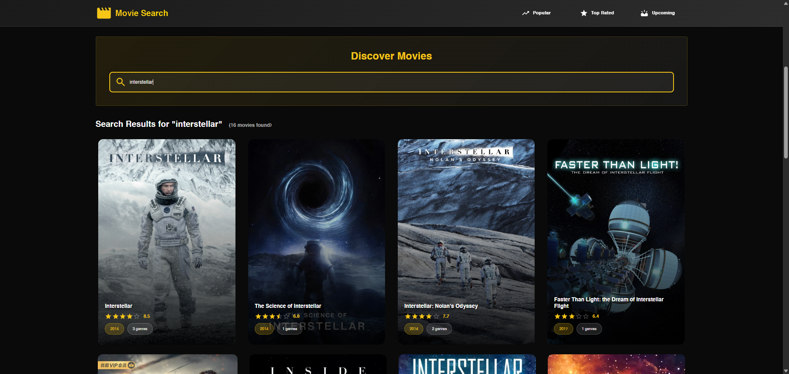

# 🎬 Movie Search

A modern, responsive movie search application built with React and Material-UI that allows users to discover, search, and explore movies with detailed information, cast details, reviews, and trailers.


## ✨ Features

### 🎯 Core Features
- **Movie Search**: Search for movies with real-time results
- **Popular Movies**: Browse trending and popular movies
- **Top Rated**: Discover highest-rated movies of all time
- **Upcoming**: See movies coming soon to theaters
- **Movie Details**: Comprehensive movie information pages

### 🎨 UI/UX Features
- **Modern Design**: Dark theme with IMDB yellow accents
- **Responsive Layout**: Optimized for desktop, tablet, and mobile
- **Smooth Animations**: Hover effects and transitions
- **Loading States**: Skeleton loaders for better UX
- **Error Handling**: Graceful error states and fallbacks

### 📱 Movie Information
- **Movie Posters**: High-quality movie posters and backdrops
- **Ratings**: Star ratings with vote averages
- **Release Dates**: Year and full release information
- **Genres**: Movie genre categorization
- **Overview**: Detailed movie descriptions
- **Runtime**: Movie duration information

### 👥 Cast & Crew
- **Cast Carousel**: Interactive carousel with cast members
- **Profile Photos**: Actor/actress profile images
- **Character Names**: Role information for each cast member
- **Responsive Design**: Optimized for all screen sizes
- **Smooth Navigation**: Previous/next buttons for easy browsing

### 🎬 Trailers & Media
- **Movie Trailers**: YouTube video integration
- **Trailer Search**: Find official movie trailers
- **Video Player**: Embedded video playback
- **Responsive Videos**: Optimized for all devices

### 💬 Reviews
- **User Reviews**: Read audience reviews
- **Review Cards**: Beautiful review display
- **Author Information**: Reviewer details
- **Rating System**: Review ratings and scores

## 🚀 Getting Started

### Prerequisites
- Node.js (version 14 or higher)
- npm or yarn package manager

### Installation

1. **Clone the repository**
   ```bash
   git clone https://github.com/yourusername/movie-search.git
   cd movie-search
   ```

2. **Install dependencies**
   ```bash
   npm install
   ```

3. **Start the development server**
   ```bash
   npm start
   ```

4. **Open your browser**
   Navigate to `http://localhost:3000` to view the application

## 🛠️ Built With

### Frontend Technologies
- **React 18.2.0** - JavaScript library for building user interfaces
- **Material-UI 7.1.2** - React component library for faster development
- **React Router DOM 6.4.2** - Client-side routing
- **React Alice Carousel 2.6.4** - Touch-friendly carousel component
- **React YouTube 10.0.0** - YouTube video player integration

### Styling & UI
- **Emotion** - CSS-in-JS styling solution
- **Material-UI Icons** - Comprehensive icon library
- **Responsive Design** - Mobile-first approach
- **Dark Theme** - Modern dark color scheme

### API Integration
- **The Movie Database (TMDB)** - Movie data and images
- **YouTube Data API** - Movie trailer integration

## 📱 Screenshots

### Home Page


### Search


### Movie Details


### Cast


### Reviews


## 🎯 Key Features Explained

### Responsive Design
The application is built with a mobile-first approach, ensuring optimal viewing experience across all devices:
- **Mobile**: Single column layout with touch-friendly interactions
- **Tablet**: Two-column layout for better space utilization
- **Desktop**: Multi-column layout with enhanced navigation

### Movie Search
- **Real-time search** with 500ms debounce
- **Filtered results** showing only complete movie information
- **Upcoming movies** as default when no search query
- **Responsive grid** layout for search results

### Cast Carousel
- **Single cast view** on mobile for better focus
- **Multiple cast view** on larger screens for efficiency
- **Smooth navigation** with custom arrow buttons
- **Responsive sizing** adapting to screen size

### Movie Details
- **Hero section** with movie backdrop
- **Comprehensive information** including ratings, runtime, genres
- **Cast & crew** section with interactive carousel
- **Movie trailers** with YouTube integration
- **User reviews** with detailed review cards

## 🔧 Available Scripts

```bash
# Start development server
npm start

# Build for production
npm run build

# Run tests
npm test

# Eject from Create React App
npm run eject
```

## 📁 Project Structure

```
movie-search/
├── public/
│   ├── index.html
│   ├── manifest.json
│   └── favicon.ico
├── src/
│   ├── Components/
│   │   ├── Header/
│   │   ├── Movie/
│   │   ├── Search/
│   │   ├── credits/
│   │   ├── reviews/
│   │   └── Show Trailer/
│   ├── Pages/
│   │   ├── Home.jsx
│   │   └── MovieDetail.jsx
│   ├── App.js
│   └── index.js
├── package.json
└── README.md
```

## 🎨 Design System

### Color Palette
- **Primary**: `#f5c518` (IMDB Yellow)
- **Background**: `#1a1a1a` to `#2d2d2d` (Dark gradient)
- **Text**: `#ffffff` (White)
- **Secondary**: `#ffd700` (Gold accent)

### Typography
- **Headings**: Bold weights with gradient text effects
- **Body**: Clean, readable fonts with proper line heights
- **Responsive**: Font sizes adapt to screen size

### Components
- **Cards**: Elevated with hover animations
- **Buttons**: Material-UI styled with custom theming
- **Carousels**: Touch-friendly with custom navigation
- **Loading**: Skeleton loaders for better UX

## 🌟 Features in Detail

### Search Functionality
- **Debounced search** prevents excessive API calls
- **Filtered results** ensure only complete movie data is shown
- **Loading states** provide user feedback
- **Error handling** for failed searches

### Movie Cards
- **Hover animations** with lift effect
- **Play overlay** on hover
- **Gradient overlays** for text readability
- **Responsive sizing** for all screen sizes

### Navigation
- **Sticky header** for easy navigation
- **Responsive menu** with icons on mobile
- **Active states** for current page indication
- **Smooth transitions** between pages

## 🤝 Contributing

1. Fork the project
2. Create your feature branch (`git checkout -b feature/AmazingFeature`)
3. Commit your changes (`git commit -m 'Add some AmazingFeature'`)
4. Push to the branch (`git push origin feature/AmazingFeature`)
5. Open a Pull Request

## 🙏 Acknowledgments

- **The Movie Database (TMDB)** for providing comprehensive movie data
- **Material-UI** for the excellent component library
- **React community** for the amazing ecosystem
- **YouTube Data API** for trailer integration

## 📞 Support

If you have any questions or need support, please open an issue on GitHub or contact the development team.

---

